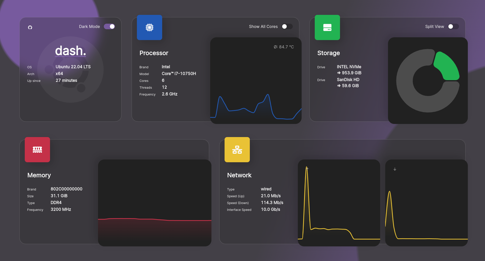
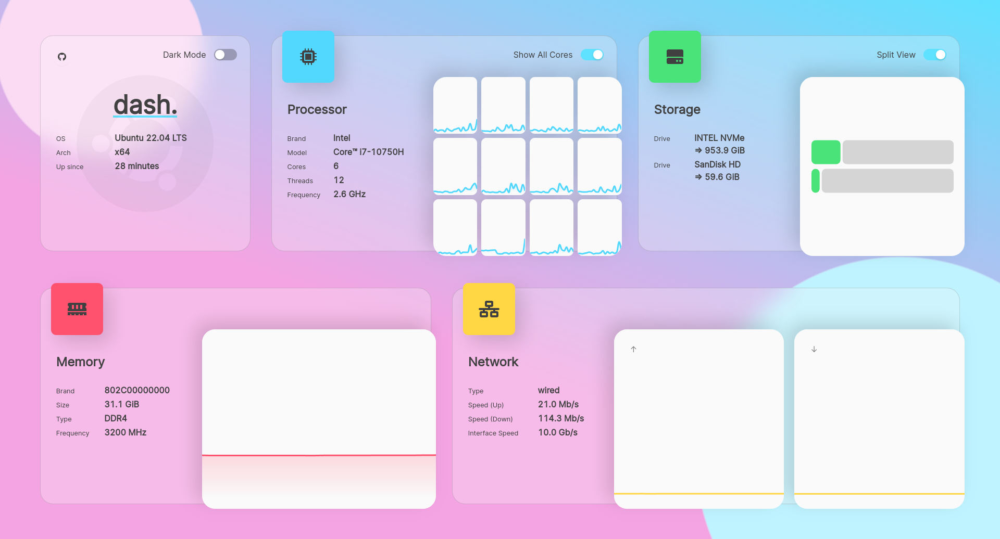

<!-- markdownlint-disable -->
<h1>
  
</h1>

<p align="center">
  <a href="https://github.com/hugobrito171/Monitess/actions/workflows/deploy.yaml?branch=main" target="_blank">
    
  </a>

  <a href="https://discord.gg/3teHFBNQ9W" target="_blank">
    
  </a>
</p>
<p align="center">
  <i>Junte-se ao <b>Discord</b> e dê uma <b>estrela</b> no repositório se gostar do projeto!</i>
</p>

<br/>

<p align="center">
  <b>monitess.</b> é um dashboard moderno para servidores,
  construído com as tecnologias mais recentes e design com efeito vidro (glassmorphism).
  Projetado para VPS e servidores privados menores.
</p>
<br />
<p align="center">
  <a href="https://monitess.mauz.dev" target="_blank">Demo Online</a>
 |
  <a href="https://hub.docker.com/r/mauricenino/monitess" target="_blank">Imagem Docker</a>
</p>

#

<a href="https://ko-fi.com/mauricenino" target="_blank">
  
</a>

<!-- markdownlint-enable -->

**monitess.** é um projeto open-source, qualquer contribuição é muito bem-vinda.
Se você tem interesse em desenvolver este projeto, dê uma olhada no
[CONTRIBUTING.md](./.github/CONTRIBUTING.md).

Para apoiar financeiramente, visite o
[GitHub Sponsors](https://github.com/sponsors/MauriceNino) ou [Ko-Fi](https://ko-fi.com/mauricenino).

## Preview

<!-- markdownlint-disable -->

| Modo Escuro                                                                                  | Modo Claro                                                                                      |
| -------------------------------------------------------------------------------------------- | ----------------------------------------------------------------------------------------------- |
|  |  |

<!-- markdownlint-enable -->

## Documentação

- [Opções de Instalação](https://getmonitess.com/docs/installation/docker)
- [Opções de Configuração](https://getmonitess.com/docs/configuration/basic)
- [Contribuindo](./.github/CONTRIBUTING.md)
- [Changelog](./.github/CHANGELOG.md)

## Instalação Rápida (Docker)

As imagens estão hospedadas no [DockerHub](https://hub.docker.com/r/mauricenino/monitess),
disponíveis para AMD64 e ARM.

```bash
docker container run -it \
  -p 80:3001 \
  -v /:/mnt/host:ro \
  --privileged \
  mauricenino/monitess
```

Para mais informações sobre flags ou outras opções de instalação
(`docker-compose`, ou compilação do código-fonte), veja as
[opções de instalação](https://getmonitess.com/docs/installation/docker).

Para mais opções de configuração, acesse as [opções de configuração](https://getmonitess.com/docs/configuration).

## Aviso de Desenvolvedor

> Nota: Devido ao crescente tamanho da pasta `.git`, causado pela combinação
> de [yarn offline mirror](https://yarnpkg.com/features/caching#offline-mirror)
> e mudanças do [dependabot](https://docs.github.com/en/code-security/getting-started/dependabot-quickstart-guide),
> tive que reescrever todo o histórico e remover a pasta `.yarn/cache`.
> Você pode ler mais sobre este problema [aqui](https://github.com/yarnpkg/berry/issues/180).
>
> Isso resultou na perda de todos os forks criados antes de 18 de março de 2025.
> Se você é um dos afetados, sinto muito pelo inconveniente.
> Por favor considere refazer o fork do repositório.
