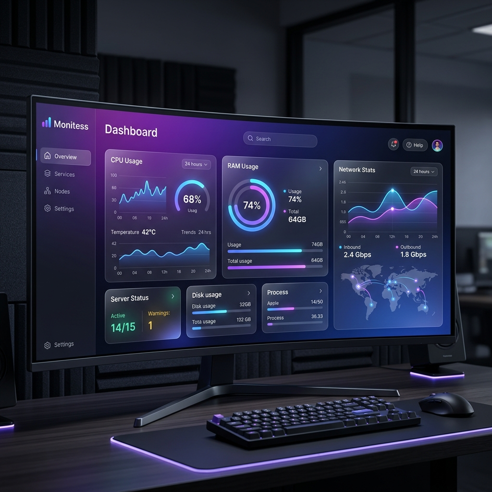

# <p align="center">Monitess.</p>

<p align="center">
  
</p>

<p align="center">
  <strong>A modern, reactive server monitoring dashboard.</strong>
  <br />
  Simple, beautiful, and customizable. Built for homelabs and servers alike.
</p>

---

## ✨ Features

- 🚀 **Real-time Monitoring**: Instant updates via Socket.io.
- 🎨 **Glassmorphic UI**: Beautiful, modern design with smooth animations.
- 💻 **Cross-Platform**: Works on Linux, Windows, and macOS (primary focus on Linux).
- 📊 **Detailed Metrics**:
  - **CPU**: Model, usage, core-specific performance, and temperatures.
  - **Memory**: Real-time utilization and distribution.
  - **Storage**: Multi-drive monitoring with drive health and capacity.
  - **Network**: Up/Down speeds, historical data, and speed tests.
  - **GPU**: Support for modern graphics cards (NVIDIA support via Docker).
- 🛠️ **Highly Customizable**: Extensive environment variables to tweak every detail.
- 🐋 **Docker Ready**: Easy deployment with Docker and Docker Compose.

---

## 🚀 Quick Start (Docker)

The fastest way to get Monitess up and running is using Docker.

```bash
docker container run -it \
  -p 80:3001 \
  -v /:/mnt/host:ro \
  --privileged \
  mauricenino/monitess
```

> **Note:** The `-v /:/mnt/host:ro` and `--privileged` flags are required for Monitess to access system information correctly from within the container.

### Docker Compose

```yaml
version: '3.8'

services:
  monitess:
    image: mauricenino/monitess
    container_name: monitess
    ports:
      - '80:3001'
    volumes:
      - /:/mnt/host:ro
    privileged: true
    restart: unless-stopped
```

---

## 🛠️ Configuration

Monitess is configured via environment variables. Here are some common options:

| Variable | Description | Default |
| :--- | :--- | :--- |
| `MONITESS_PORT` | The port the server should run on. | `3001` |
| `MONITESS_ENABLE_CPU_TEMPS` | Enable CPU temperature display. | `false` |
| `MONITESS_WIDGET_LIST` | Comma-separated list of widgets to display. | `os,cpu,storage,ram,network` |
| `MONITESS_PAGE_TITLE` | The title of the dashboard page. | `monitess.` |
| `MONITESS_USE_IMPERIAL` | Use imperial units (Fahrenheit, etc.). | `false` |

For a full list of configuration options, check the [official documentation](https://getmonitess.com/docs/configuration).

---

## 📦 Manual Installation (From Source)

If you prefer to run it manually, ensure you have **Node.js 20+** and **Yarn 4** installed.

1. **Clone the repository:**
   ```bash
   git clone https://github.com/MauriceNino/monitess.git
   cd monitess
   ```

2. **Install dependencies:**
   ```bash
   yarn install
   ```

3. **Run in development mode:**
   ```bash
   yarn dev
   ```

4. **Build and run for production:**
   ```bash
   yarn build
   yarn start
   ```

---

## 🛡️ License

Monitess is released under the [MIT License](LICENSE.md).

## 💬 Community

- **Discord**: [Join our community](https://discord.gg/S7YmU3B)
- **GitHub**: [Report Bugs & Request Features](https://github.com/MauriceNino/monitess/issues)

---

<p align="center">
  Made with ❤️ by <a href="https://github.com/MauriceNino">Maurice Nino</a> and contributors.
</p>
